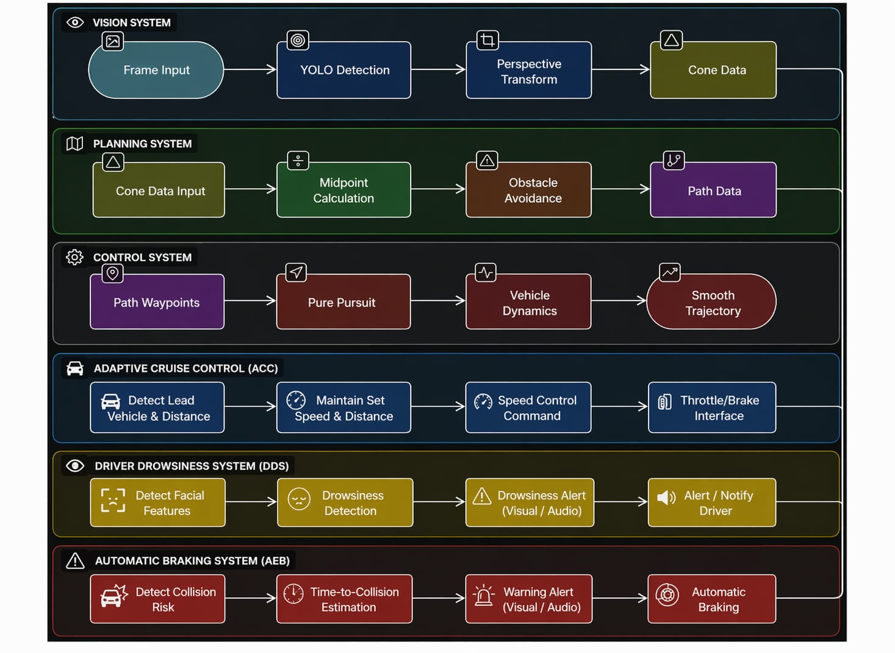
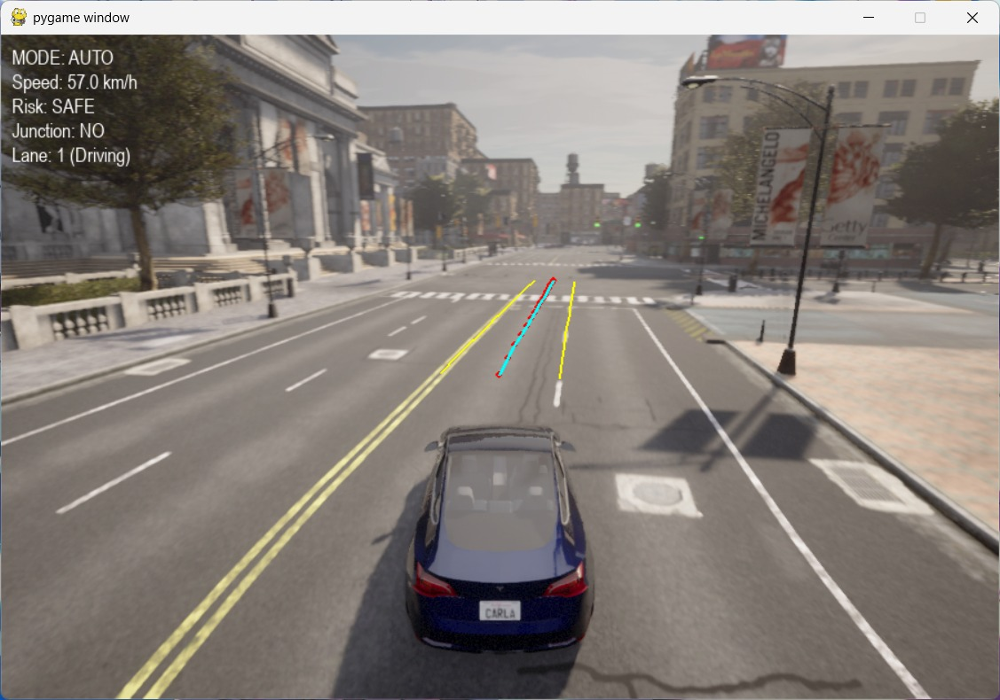
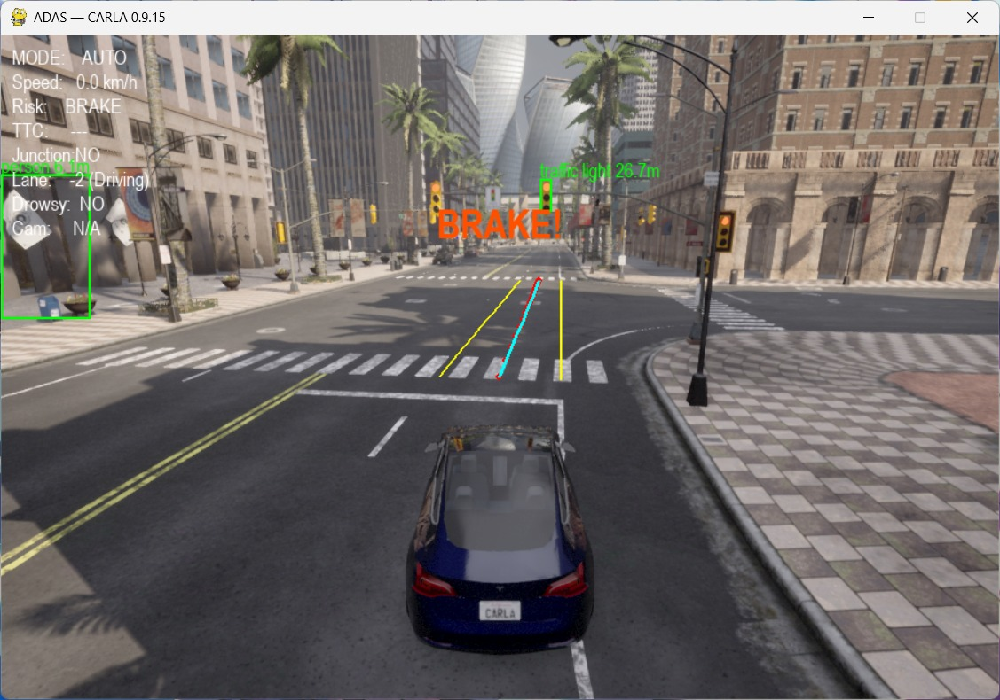
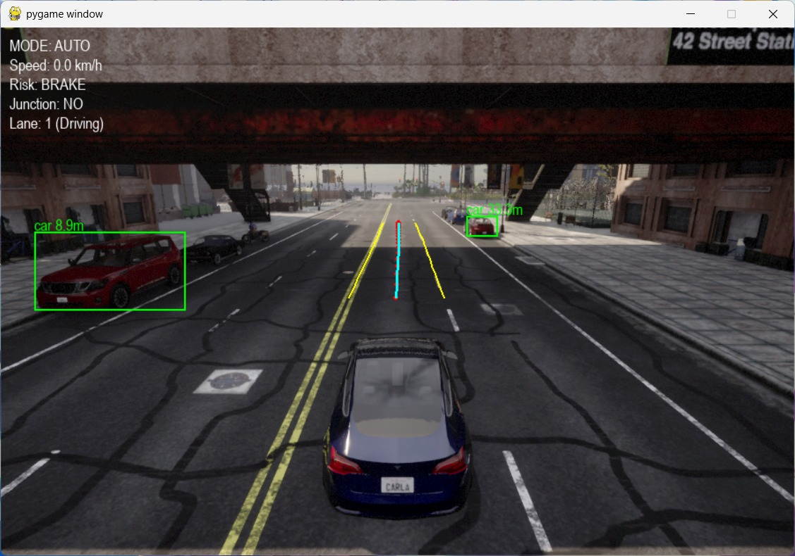

# SmartDrive: AI-Based ADAS Simulation

From recorded cone-course perception to a live CARLA simulation, SmartDrive is a two-stage computer-vision and advanced driver-assistance project. It keeps the practical learning path visible: first understand the road from a camera feed, then use those ideas in a simulated vehicle with ADAS controls and driver-state monitoring.

> Educational and research software. It is not a real-vehicle control system and must not be used for on-road driving.

## Project story

| Phase | Focus | Deliverables |
| --- | --- | --- |
| 1 — Recorded-video perception | Detect coloured cones, project a bird's-eye view, derive a centre line, avoid obstacles, and smooth the path. | Annotated camera view, top-view path, calibration tools. |
| 2 — CARLA ADAS simulation | Apply perception and control concepts in CARLA with manual/autonomous modes, risk-aware braking, vehicle control, HUD alerts, and a driver drowsiness monitor. | Interactive CARLA simulation and supporting frame-stream tools. |

## Highlights

- YOLO-based cone detection with CPU/GPU selection.
- Perspective transform and midpoint path planning for a cone-defined course.
- Obstacle-aware trajectory adjustment and Pure Pursuit path smoothing.
- CARLA vehicle control with adaptive cruise, emergency braking logic, and visual risk alerts.
- Driver monitoring based on eye aspect ratio, mouth aspect ratio, and head tilt.
- One portable [`config.py`](config.py) for repository-relative files; no developer-specific paths.

## Repository layout

```text
SmartDrive/
├── src/
│   ├── phase1/                 # recorded-video perception pipeline
│   │   ├── cone_detector.py
│   │   ├── cone_path_planner.py
│   │   └── calibration/
│   └── phase2_carla/           # CARLA ADAS simulation
│       └── drowsiness/         # integrated feature helpers
├── scripts/                    # optional CARLA frame server/client and cone spawner
├── data/
│   ├── samples/                # local input videos (ignored)
│   └── models/                 # weights/assets; large landmark model ignored
├── docs/images/                # architecture and ADAS screenshots
├── outputs/                    # generated videos (ignored)
├── config.py                   # central paths
├── requirements.txt
└── THIRD_PARTY_NOTICES.md
```

## System snapshots

| Architecture | Adaptive cruise control |
| --- | --- |
|  |  |

| Automatic emergency braking | CARLA emergency-braking scenario |
| --- | --- |
|  |  |

## Setup

Use Python 3.10 for the smoothest CARLA and dlib compatibility.

```bash
git clone <your-repository-url>
cd SmartDrive
python -m venv .venv
```

Activate the environment:

```powershell
.venv\Scripts\Activate.ps1
```

```bash
pip install -r requirements.txt
```

Place a cone-course recording in `data/samples/` and the facial-landmark file at `data/models/drowsiness/shape_predictor_68_face_landmarks.dat`. Details and Git-size notes are in [`data/README.md`](data/README.md).

## Run Phase 1

Run commands from the repository root. The defaults use the repository-local model and sample-video locations.

```bash
# Cone detections only
python -m src.phase1.cone_detector --video data/samples/cone_course_01.mp4

# Full top-view path planning pipeline
python -m src.phase1.cone_path_planner --video data/samples/cone_course_01.mp4
```

Generated videos are written to `outputs/`. Add `--debug` to either command to view live OpenCV windows. Supply a different `--model`, `--video`, or `--output-dir` whenever needed.

Calibration is deliberately interactive:

```bash
python -m src.phase1.calibration.top_view_calibration path/to/frame.jpg
python -m src.phase1.calibration.localization_calibration path/to/frame.jpg
```

## Run Phase 2

1. Install and launch the CARLA server compatible with the `carla` Python package.
2. Ensure it is listening on `localhost:2000`.
3. Connect a working webcam and add the dlib landmark model described above.
4. Start the simulator:

```bash
python -m src.phase2_carla.main
```

The simulator starts in manual mode. Use `M` to toggle autonomous mode; `1`, `2`, and `3` switch camera views; `T` spawns a vehicle ahead; `F`/`F11` toggles fullscreen. Press `Q` in the driver-monitor window to stop that feed.

The optional helpers in `scripts/` support a CARLA camera-frame streaming experiment. They are not required for the main Phase 2 demo.

## Design decisions

- Configuration and default file paths live only in [`config.py`](config.py).
- Large recordings, generated videos, and the 100 MB dlib model are ignored to keep GitHub clones light and avoid GitHub's file-size limit.
- Phase 2 is a Python package, so it should always be launched with `python -m src.phase2_carla.main` rather than by opening its file directly.
- External drowsiness helper code is identified in [`THIRD_PARTY_NOTICES.md`](THIRD_PARTY_NOTICES.md).

## Validation

The repository includes lightweight structural tests that do not require CARLA, a webcam, GPU access, or running inference:

```bash
python -m pytest -q
python -m compileall -q config.py src scripts tests
```

For an end-to-end test, use a local cone video with the Phase 1 command above, then run the CARLA procedure with its server and webcam available.

## License

Released under the [MIT License](LICENSE). See [`THIRD_PARTY_NOTICES.md`](THIRD_PARTY_NOTICES.md) for dependency and reused-helper notices.
